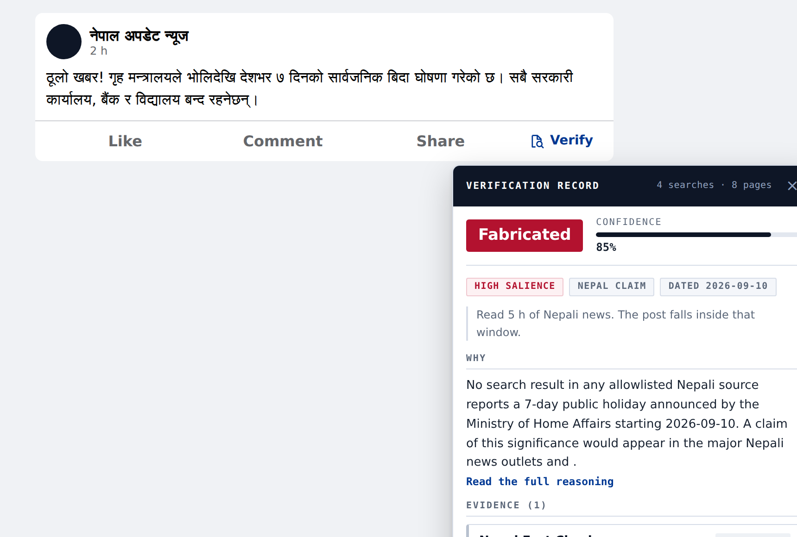

# Verify — a misinformation check for Facebook posts

A Chrome extension for a classroom demonstration. It adds a **Verify** button to
Facebook posts. The button runs a verification pipeline over Nepali fact checks,
Nepali news and six international outlets, then shows a verdict, a confidence
score and the evidence it used.

It needs one API key and nothing else. No server, no build step, no config file.



> The output is a model judgement, not a fact check by a journalist. Read the
> sources before you repeat anything it says. The post in the picture is a
> made up example, written for the demonstration.

## The point of it

The interesting part is not that a model can search the web. It is what the
pipeline refuses to do.

A checker that finds nothing has two ways to read that silence:

- "I found nothing, so this is fake."
- "I found nothing, and my sources cannot tell me either way."

The first one is how a true post gets labelled fake. This project treats the
absence of evidence as a finding **only** when its own sources would certainly
hold the claim if it were true. Four guards enforce that, and they run as plain
JavaScript, not as a request to the model. See [Verdict rules](#verdict-rules).

## What it does

1. Reads the post: the caption, and any image, in Devanagari Nepali, Romanized
   Nepali or English. Most misinformation in Nepal travels as a graphic, so the
   image is read first.
2. Breaks the post into atomic claims.
3. Weighs salience: if the claim were true, would it certainly appear in the
   sources this search can actually read?
4. Searches those sources.
5. Judges each source: supports, refutes or irrelevant.
6. Applies the verdict rules.
7. Checks every citation against what the search really returned, and drops any
   the model invented.

The card leads with the verdict, the confidence, one line on what the check
could read, a short reason, and the sources that carried weight. The stages,
the full reasoning, the claims, the coverage scale and any dropped citation sit
behind **How this was checked**.

## Install

1. Get a DeepSeek API key at <https://platform.deepseek.com/>. It needs credit
   on it; a run costs a fraction of a cent.
2. Download this repository (**Code → Download ZIP**, then unzip, or clone it).
3. Open `chrome://extensions`, turn on **Developer mode**, click **Load
   unpacked**, and choose the folder.
4. Click the Verify icon in the toolbar, paste the key, and save.
5. Open Facebook, reload the page, and look for **Verify** in the row with Like,
   Comment and Share.

The key is kept in that browser, in extension storage. It is sent to DeepSeek
and nowhere else. A run takes 30 to 60 seconds.

If the button does not appear, open the console with F12 and run
`verifyReport()` in the Verify extension's context. It prints what was found.
Facebook rewrites its markup often; `content/selectors.js` holds every
Facebook-specific rule, so that is the only file to patch.

## Sources

Only these are searched, and only these can be cited.

**Nepal.** Nepal Fact Check, TechPana, The Kathmandu Post, Onlinekhabar,
Setopati, Ekantipur, and any `.gov.np` domain.

**International.** BBC News, Al Jazeera, The Guardian, The Straits Times,
Channel NewsAsia, NDTV.

There is no search API and no second key. The extension reads these sites
directly:

- **Nepal Fact Check** answers a full text search, because WordPress serves a
  search result as an RSS feed. A published debunk is the strongest evidence the
  pipeline can find.
- **The news sites** publish feeds of recent articles. The extension matches the
  claim against them. This is where citable links come from.
- **Google News** search, as RSS, says whether the press carries the story at
  all. It hides the real article URL behind a redirect, so those results are
  headlines only. They are never citable and never evidence.

## Verdict rules

The model proposes a verdict. `background/pipeline.js` then derives one from the
evidence and overrides the model if they disagree, saying so in the panel.

| Evidence | Condition | Verdict |
| --- | --- | --- |
| A source refutes the claim | any | **Fabricated**, 0.85+ |
| A source supports the claim | any | **Verified**, 0.7+ |
| Nothing found | high salience, recent, Nepal, inside the feed window | **Fabricated**, 0.8+ |
| Nothing found | low salience | Not established |
| Nothing found | claim dated before the feed window | Not established |
| Nothing found | claim about another country | Not established |
| Nothing found | the post carries no date | Not established |
| The search returned nothing anywhere | any | Not established |
| No citable page, but the press carries the claim, at home or abroad | any | Not established |

Everything below the first two rows is a guard, and each one exists because the
pipeline called a real claim fabricated without it.

- **The feed window.** A Nepali news feed holds only the last few hours of
  articles. Setopati publishes five items. So "the press did not report it"
  really means "it was not published in the last few hours". The extension
  measures that window on every run and refuses to read silence about a day the
  feeds do not cover. Without this guard, a true story from two days earlier was
  called fabricated.
- **Scope.** Every Nepali source is silent about a cabinet decision in
  Singapore. Absence there says nothing, so a foreign claim can be verified by
  the international feeds but never called fabricated by their silence.
- **Salience.** A private meeting can be real and leave no public record.
- **An undated post.** The feeds cover a few hours. If the post gives no date,
  it cannot be placed against that window, so silence cannot convict it.
- **A failed search.** A search that comes back empty everywhere, including the
  world press, has said nothing about the claim. That is a broken query, not an
  absent story. The searches are kept to three or four words for the same
  reason: the search joins words with AND, so a long query returns nothing.
- **Press coverage.** If the press carries the claim, it is not absent. That
  includes the press outside the source list: a story reported abroad cannot be
  cited here, but it is plainly not missing from the record. Whether a headline
  is about *this* claim is a judgement about meaning, so the model makes it; a
  count of headlines cannot.

Salience itself is measured against the sources the search can read, not against
how big the news feels. That distinction is the whole design.

## Files

| File | Purpose |
| --- | --- |
| `manifest.json` | Manifest V3 declaration |
| `popup/` | The setup screen. One field: the API key. |
| `content/selectors.js` | Every Facebook-specific rule. Patch this when Facebook changes. |
| `content/content.js` | Finds posts, places the button, checks it can be seen |
| `content/panel.js` | The verdict card |
| `content/styles.css` | Styles, light and dark |
| `background/service-worker.js` | Runs the check, holds the key, fetches post images |
| `background/pipeline.js` | Prompt, source lists, grounding check, verdict rules |
| `background/deepseek.js` | The model call and its search tool loop |
| `background/search.js` | The keyless search over the source list |
| `tools/` | A browser harness for testing the pipeline without Facebook |

## Testing without Facebook

`tools/` holds a small bridge and a harness page, so the pipeline can be run
against pasted text or an image. It imports the same modules the extension uses.

```
export DEEPSEEK_API_KEY=...
node tools/bridge.mjs          # then open http://localhost:8777/tools/harness.html
```

The harness shows the stages, the real search queries, the evidence, the dropped
citations and the raw model reply, and it can run several posts in a row.

## Limits

- It is a model judgement. It is not a fact check by a journalist.
- The source list is short. A true claim reported only outside it reads as no
  evidence.
- The news feeds reach back only a few hours. Only the fact check search reads
  an archive. An older claim can reach "not established", never "verified".
- Ekantipur publishes no feed and no API, so it can only appear as a headline.
- A `.gov.np` subdomain that has been hacked can appear in results. The list
  trusts the whole `.gov.np` space.
- Post detection was verified against Facebook's web feed in September 2026.
  Facebook varies its markup by account and rewrites it often.

## Licence

MIT. See `LICENSE`.
